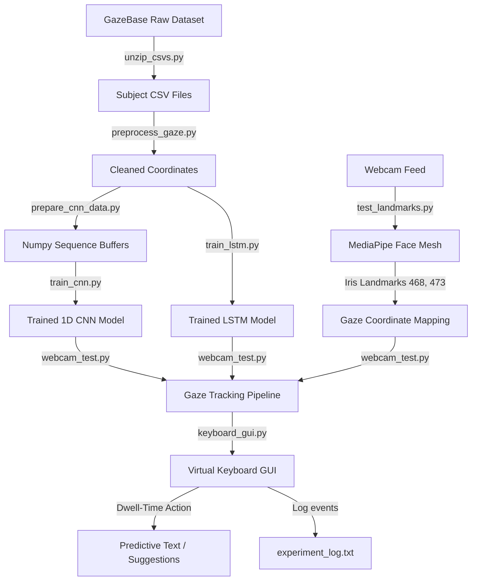

# 🧠 Eye Communicator

**Eye Communicator** is an intelligent, gaze-based text entry system designed to assist individuals with Amyotrophic Lateral Sclerosis (ALS) and other severe motor impairments. By tracking eye movements using a standard webcam, users can input text on a virtual keyboard and communicate effectively without any physical contact.

The project features deep learning models (1D-CNN and LSTM) trained on large-scale datasets, coupled with a real-time tracking interface powered by MediaPipe and OpenCV, and a responsive Tkinter-based virtual keyboard.

---

## 🚀 Key Features

* **👁️ Real-time Gaze Tracking**: Robust face mesh and iris landmark tracking (MediaPipe Iris) from a standard webcam feed.
* **🧠 Deep Learning Models**: 1D Convolutional Neural Network (Conv1D) and LSTM models for classifying gaze sequences and predicting temporal eye movements.
* **⌨️ Dwell-Time-Based Virtual Keyboard**: An on-screen interactive keyboard (Tkinter) where letters are selected by gazing at them for a configurable dwell period (1.0 second).
* **🔮 Predictive Text Autocomplete**: Displays context-aware word suggestions based on custom word lists (e.g., hello, help, water, toilet) to minimize typing effort.
* **📊 Quantitative Experiment Logging**: Automatically logs gaze coordinates, selection history, text logs, and latency metrics to `experiment_log.txt` for clinical and research evaluation.

---

## 📁 Project Structure

```text
gaze_base/
├── data/                         # Dataset storage (git-ignored)
│   ├── Round_*/                  # Raw GazeBase dataset round folders (subject zips)
│   ├── csvs/                     # Unzipped raw subject CSV datasets
│   ├── processed/                # Preprocessed gaze CSVs (NaNs removed, cleaned coordinates)
│   ├── cnn/                      # Prepared numpy sequence arrays (X.npy, y.npy) for CNN training
│   └── webcam/                   # Collected webcam pupil tracking data
├── diagram/                      # Architecture diagrams and design layouts
│   └── pipeline_gaze_entry.puml  # PlantUML system architecture and flow diagram
├── models/                       # Model checkpoints & training history plots
│   ├── gaze_cnn.h5               # Trained 1D CNN model weights
│   ├── lstm_gazebase.h5          # Checkpoint of the best-performing LSTM model
│   ├── lstm_gazebase_final.h5    # Final saved LSTM model
│   └── training_history.png      # Loss and MAE curves during training
├── src/                          # Application source code
│   ├── unzip_csvs.py             # Extracts downloaded GazeBase subject ZIP files
│   ├── preprocess_gaze.py        # Normalizes and cleans raw CSV gaze datasets
│   ├── prepare_cnn_data.py       # Sequences cleaned gaze data into temporal windows for CNN
│   ├── train_cnn.py              # Trains 1D CNN regression model on gaze coordinates
│   ├── test_cnn.py               # Evaluates the 1D CNN model on a sample dataset
│   ├── train_lstm.py             # Trains the sequence-to-screen coordinate LSTM model
│   ├── gaze_detection.py         # Trains a baseline linear regression gaze tracker from webcam data
│   ├── test_landmarks.py         # Diagnostic tool to verify webcam face mesh & iris landmarks
│   ├── webcam_test.py            # Diagnostic tool to test live webcam gaze predictions using the CNN
│   └── keyboard_gui.py           # Main virtual keyboard GUI application with real-time tracking
├── nltk_text_processing.py        # Tokenization and stemming text preprocessing demonstration
├── requirements.txt              # Project package dependencies
└── README.md                     # Documentation
```

---

## 🔄 System Architecture and Workflow

The system operates in two phases: **model training** (offline dataset processing) and **real-time inference** (live webcam interaction).



---

## 🛠️ Setup & Installation

### Prerequisites
* Python 3.8 - 3.10
* A webcam connected to your system

### Installation Steps

1. **Clone the Repository:**
   ```bash
   git clone https://github.com/chahatgupta/eye_communicator.git
   cd eye_communicator
   ```

2. **Create a Virtual Environment (Optional but recommended):**
   ```bash
   python -m venv venv
   # On Windows:
   venv\Scripts\activate
   # On macOS/Linux:
   source venv/bin/activate
   ```

3. **Install Dependencies:**
   ```bash
   pip install -r requirements.txt
   ```

4. **NLTK Corpus Setup:**
   For tokenization and text preprocessing utilities:
   ```bash
   python -c "import nltk; nltk.download('punkt')"
   ```

---

## 📦 How to Run

> [!NOTE]
> Some scripts contain absolute file paths configured for a specific home directory structure. Be sure to review and adjust file paths in the `src/` files to match your local installation folder if necessary.

### Step 1: Data Setup (Optional)
If training models from scratch using the [GazeBase Dataset](https://www.cs.bham.ac.uk/~eyetracking/GazeBase/):
1. Place the downloaded round folders (e.g., `Round_1`) containing subject `.zip` files under the `data/` directory.
2. Unzip all subject CSVs:
   ```bash
   python src/unzip_csvs.py
   ```
3. Preprocess and clean the raw gaze dataset:
   ```bash
   python src/preprocess_gaze.py
   ```

### Step 2: Model Training
To train the neural networks on the GazeBase datasets:
1. **Prepare CNN sequences:**
   ```bash
   python src/prepare_cnn_data.py
   ```
2. **Train 1D-CNN regression model:**
   ```bash
   python src/train_cnn.py
   ```
3. **Train LSTM sequence model:**
   ```bash
   python src/train_lstm.py
   ```
   *This saves the best-performing checkpoints in the `models/` directory and generates training evaluation curves (`models/training_history.png`).*

### Step 3: Diagnostic Testing
Before launching the virtual keyboard, test the tracking configurations:
1. **Verify MediaPipe Face Mesh & Iris landmark detection:**
   ```bash
   python src/test_landmarks.py
   ```
   *Ensures the camera successfully tracks facial features. Press `q` to quit the video preview.*
   
2. **Test live CNN-based gaze coordinate estimation:**
   ```bash
   python src/webcam_test.py
   ```
   *Displays a live video window with green circles representing predicted coordinates. Adjust your seating and illumination as needed.*

### Step 4: Run the Virtual Keyboard Application
Launch the gaze-controlled communication portal:
```bash
python src/keyboard_gui.py
```
* **Virtual Grid Selection**: Look at a letter key on the 6x5 keyboard grid. If the gaze dot remains over the key for 1.0 second (dwell time), the letter is selected and typed.
* **Text Auto-suggestions**: Selecting letters updates suggestions dynamically. Gazing at suggestion buttons at the top instantly fills in the word.
* **Logging**: Selection updates, input coordinates, and application events are saved in `experiment_log.txt`.

---

## 🧠 Scientific Principles

1. **Iris Landmark Localization**:
   MediaPipe refinement identifies eye boundaries (left corners: landmark index 33, 133) and iris center points (left iris: 468, right iris: 473).
2. **Geometric Normalization**:
   Gaze coordinates are normalized by calculating the ratio between the iris center distance and the overall eye width. This offsets variations caused by head movements or distance from the camera:
   $$\text{gaze\_x} = \frac{\text{iris\_x} - \text{eye\_inner\_x}}{\text{eye\_width}}$$
3. **Temporal Smoothing**:
   To prevent gaze jitter (rapid fluctuations), a buffer of past predictions is stored. A rolling average (moving window smoothing) is applied before trigger calculations to ensure smooth controls.

---

## 🧪 Dataset Reference
This project utilizes datasets from the **GazeBase Database**:
* **Citation**: Griffith, H., et al. "GazeBase: A large-scale, multi-session eye-movement dataset." *Scientific Data*, 2021. 
* Learn more or request access [here](https://www.cs.bham.ac.uk/~eyetracking/GazeBase/).
